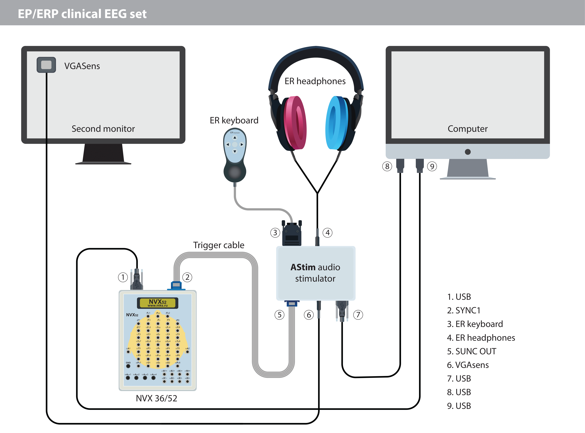

# AStimWavPatcher

Example script for writing AStim commands to WAV files (trigger 6).
AStim works with 16-bit WAV files with a sampling rate of _44100 Hz_.

## Requirements

To run the script you need [Python](https://python.org/) (3.4 or higher), [numpy](https://numpy.org/) and [scipy](https://scipy.org/) packages.

## Command Description

The commands are 3-bit, each bit is encoded with sequence of two 16-bit samples in the right channel:

    0: -32768 and +32767;
    1: +32767 and -32768.

There should be no gaps between the bits.  
There must be at least one sample with zero value between commands.  
If there are no commands, then there are only zero samples in the right channel.  

If there are zero samples on the right channel, the A-Stim goes into mono (the right channel receives samples from the left channel).  
If there are non-zero samples on the right channel, the A-Stim goes into standard stereo mode.  

Commands:
1) 000 - disable left channel, 001 - enable left channel (default);
2) 010 - disable right channel, 011 - enable right channel (default);
3) 100 - set trigger 6 LOW, 101 - set trigger 6 HIGH (default);
3) 110 - set trigger 7 LOW, 111 - set trigger 7 HIGH (default).

## File examples

The [audio/examples](./audio/examples) folder contains examples of WAV files with added commands in the right channel.  
The file [audio/examples/output_example_1s.wav](./audio/examples/output_example_1s.wav) was obtained by processing the file [audio/origin/input_example_1s.wav](./audio/origin/input_example_1s.wav) by the script [wavpatcher.py](./wavpatcher.py).
