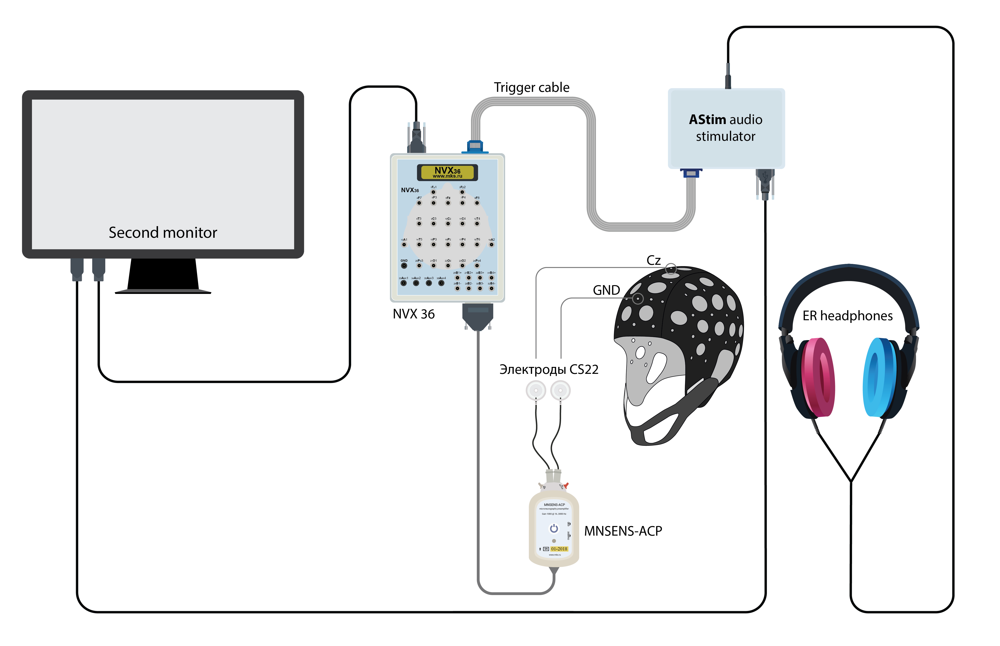
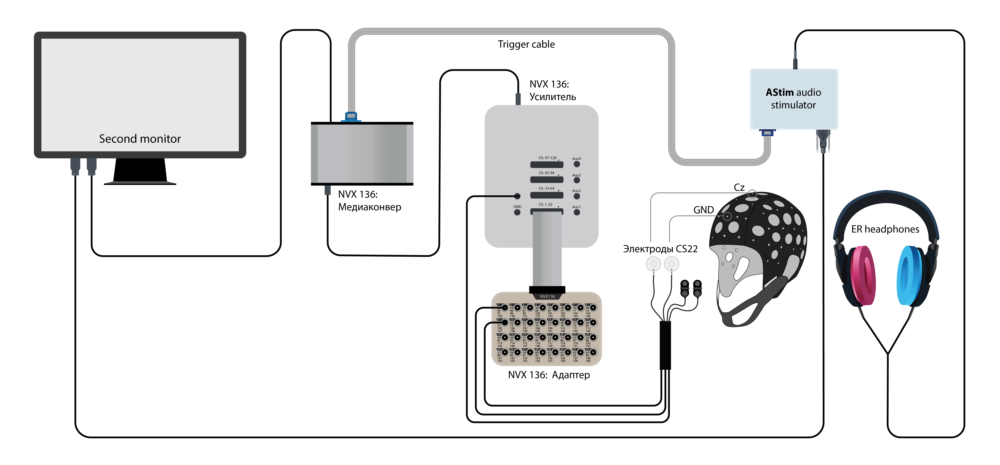

## ASTIM: Stimuli with triggers

This repository includes the protocol and examples demonstrating how to embed AStim commands into a WAV file using Python

> Attention!  
    AStim works _only_ with __16-bit__ WAV files with a sampling rate of __44100 Hz__.

## Configuration with ASTIM + EEG NVX36 Suite

## Configuration with ASTIM + EEG NVX36 Suite

## AStim Command Description

The commands are 3-bit, each bit is encoded with sequence of two 16-bit samples in the right channel:

    0: -32768 and +32767;
    1: +32767 and -32768.

There should be no gaps between the bits.  
There must be at least one sample with zero value between commands and prior to the first command.   

Commands:
1) 000 - disable left channel, 001 - enable left channel (default);
2) 010 - disable right channel, 011 - enable right channel (default);
3) 100 - set trigger 6 LOW, 101 - set trigger 6 HIGH (default);
3) 110 - set trigger 7 LOW, 111 - set trigger 7 HIGH (default).

> Attention

    AStim correctly transfers triggers only when they are encoded in the right channel with ASTIM commands and zeros elsewhere. No additional channel activation is required.
    Including a RESET CYCLE command when generating the audio file helps reduce trigger loss.
    Implementation details can be found in the add_triggers() and make_full_signal() functions in functions.py (Frequency_Following_Response_Astim v1).

##  WAV file with ASTIM triggers for Frequency Following Response (FFR) Project

A WAV file with audio stimuli was generated using ASTIM for FFR project.

To mitigate bone‑conduction artifacts, two trigger types are used: 

\- trigger 6: original stimulus polarity.

\- trigger 7: inverted stimulus polarity.

Trigger timing protocol:

\- At the onset of each stimulus, the corresponding trigger (6 or 7) is set to LOW.

\- At the end of the stimulus, the trigger is set to HIGH. 

WAV file https://docs.mks.ru/en/file/6a575b8d86e5e#to-docs

## Audio stimuli generation

The `create_wav.py` script (from Frequency_Following_Response_Astim v1) generates WAV files containing:

\- Syllable stimuli (e.g., “Da”), or

\- Sinusoidal tones within a predefined frequency range.

Example calls:
           
Multiple sinusoidal tones at specified frequencies

           python create_wav.py  --function multiple_sin --F 110 220 440 880 --TS 100 --TP 100 --N 2 --INV 0

Repeated “Da” syllable with inverted polarity

           python create_wav.py  --function repeated_da  --TS 100 --TP 100 --N 100 --INV 1 --wavfname '\\MCSSERVER\DB Temp\physionet.org\FFR\stim\DA+20.wav' 

--F frequency

--TS stimulus latency

--TP interstimulus interval (pause) latency

--N number of stimulus repetitions

--INV add polar (inverted) stimulus

--wavfname path to an example of syllable to be multiplied and wrapped into audio stimulation

For a full list of arguments, run:

            python create_wav.py -h

# Frequency Following Response Project
https://en.wikipedia.org/wiki/Frequency_following_response

Frequency Following Response (FFR) is a neurophysiological response to an auditory stimulus that reflects the neural processing of its acoustic parameters with high precision.

## Equipment, software, documentation

AStim Auditory stimulator for FFR paradigms https://mks.ru/en/products/ep-erp https://docs.mks.ru/ru/file/682f7130953d8#to-docs

NVX 36 EEG acquisition system https://mks.ru/en/products/nvx

NVX 136 EEG acquisition system https://mks.ru/en/products/nvx-136

MCScap EEG cap system https://mks.ru/en/products/mcscap

Electrodes MCScap-CS22 Dry/gel electrodes for stimulation and recording https://mcscap.ru/catalog/tes-elektrody-dlya-stimulyatsii/mcscap-cs22/

NeoRec 1.6 Data acquisition and control software https://docs.mks.ru/en/file/65dd0ac5d6895#to-docs

Frequency_Following_Response_Astim (v1) Custom Python suite for FFR stimulus generation and analysis https://github.com/asmyasikova83/Frequency_Following_Response_Astim.git

FFR Astim v1 Documentation https://docs.mks.ru/download/6a50e1d6de9d5

## Preprocessing and Visualization of FFR

The `command_line_ffr.py` script performs FFR preprocessing and generates a PDF report containing:

\- Waveform and spectrum of the stimulus.

\- Grand average of the FFR response and its spectral representation.

\- Correlation coefficient 𝑅 between the stimulus waveform and the FFR waveform (computed over averages).

\- Signal to Noise Ratio in the time interval of formant transition [19.5 44.2] ms /DOI: 10.1016/j.heares.2019.107779/ (computed over averages).

Data files (`.bfd/.fif`) and associated stimuli (`.wav`) are selected interactively.

Example call:
        
            python command_line_ffr.py --TS 250 --TP 200 --fmin 80 --fmax 1500 --tmin -100 --tmax 300 --N 500

--TS: stimulus latency

--TP: interstimulus interval (pause) latency

--fmin: lower cutoff frequency for filtering

--fmax: upper cutoff frequency for filtering

--tmin: lower boundary of the time window (ms)

--tmax: upper boundary of the time window (ms)

--N: number of stimulus repetitions

For a full list of arguments, run:

            python command_line_ffr.py -h

## Software Requirements (Frequency_Following_Response_Astim v1)

        matplotlib==3.8.4
        mne==1.12.1
        numpy==2.3.4
        pandas==2.3.3
        pypdf==6.13.1
        reportlab==4.5.1
        scipy==1.16.3

